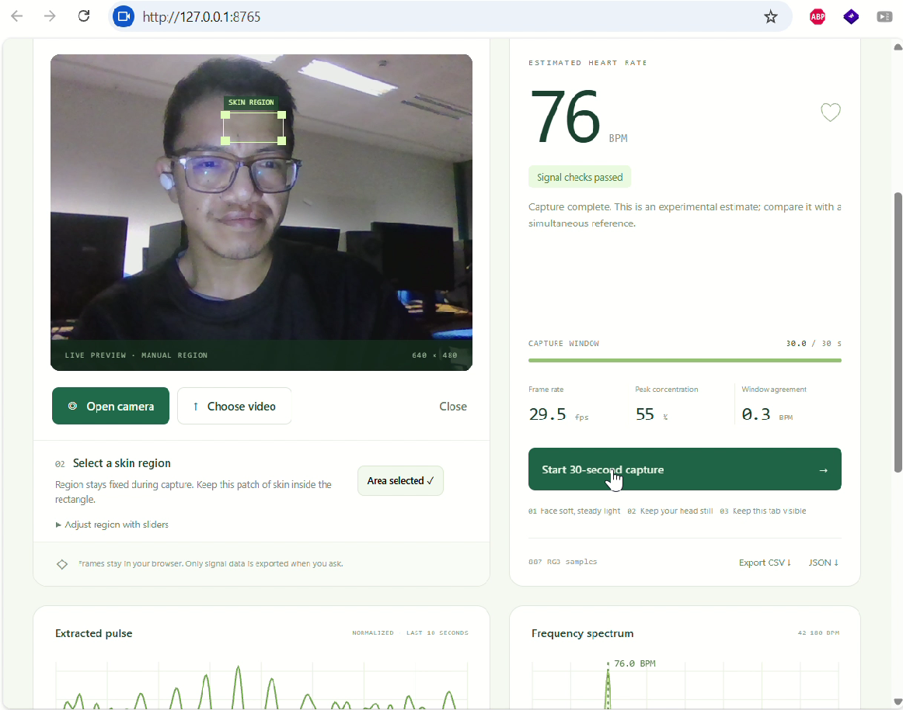

# FacePulse

This project is a local, browser-based implementation for estimating a periodic pulse signal from a selected region of facial skin in a video. It is motivated by the concept of remote photoplethysmography (rPPG), where subtle changes in skin color caused by variations in blood volume are captured through a standard camera rather than a dedicated physiological sensor.

The pipeline takes a short face video, extracts a region of interest (ROI) from the skin, processes the resulting pixel-intensity signals, and applies signal-processing techniques to identify the dominant cardiac frequency. The detected frequency can then be converted into an estimated heart rate in beats per minute (BPM).

The project is intended primarily as an experimental and educational exploration of rPPG, combining computer vision, signal processing, and physiological signal analysis. It runs locally in the browser, allowing the experiment to be performed without requiring a smartwatch, chest strap, or other body-worn sensor.





## Result : After 3 successive test, below is the result.

| Recording | Estimated BPM | App’s signal checks |
|---|---:|---|
| 1 | 77.2 | Passed |
| 2 | 81.2 | Passed |
| 3 | 76.0 | Passed |


Left image statistic (Extracted Pulse): Displays the normalized pulse waveform restricted to the last 10 seconds of capture (-10 s to 0 s) with the standard subtitle "Relative amplitude · not an ECG".  
 Right image statistic (Frequency Spectrum): Displays the filled green frequency power distribution across 42–180 BPM, featuring the dashed vertical peak line and exact BPM annotation (76.0 BPM shown from Recording 3)

## Run it

Requires **Node.js 18 or newer** and a recent Chrome browser. There are **no packages to install**.

On Windows, double-click `start.bat`. Or open a terminal in this folder:

```sh
node server.mjs
```

Open **http://127.0.0.1:8765**. Keep the server terminal running; press Ctrl+C to stop it. If the port is busy, stop your previous FacePulse server or set `PORT` to another available port. Serve through localhost or HTTPS so camera access is available. Opening the HTML file directly is not supported because the app uses ES modules.

## Try it

1. Click **Try synthetic demo** to explore the graphs immediately. The generated input is 72 BPM. This is explicitly simulated data, not a measurement or validation on a person.
2. Click **Open camera**, then allow camera access in Chrome; or **Choose video** and select a local MP4/WebM face recording of at least 20 seconds (30+ recommended). Unsupported codecs are reported. No audio is requested.
3. Drag a rectangle over a clean forehead or cheek patch and click **Use selected area**. Clicking positions a default rectangle; sliders offer keyboard adjustment. Video is shown without mirroring. Avoid hair, eyes, mouth, shadows and specular highlights.
4. Click **Start 30-second capture**. Remain still in soft, steady light. Leave this tab visible. Estimates begin after 20 seconds and refresh about once a second. Uploaded clips play at their normal speed from the beginning. Shorter accepted clips finish at the end of the video.
5. Inspect the pulse and spectrum. **Export CSV** saves timestamped mean RGB and clipping fractions. **JSON** includes the result, rejection reasons, ROI, samples, normalized waveform, frequency spectrum and source type.
6. Click **Close** to turn off the camera and clear the in-memory session. Reloading also clears the session. Export files remain wherever you saved them.

The ROI is **manual and fixed**, with no face detection or motion tracking. Keep skin inside it for the entire capture. This is an intentional baseline that works without downloading a model. Automated landmark tracking is a future extension, not an existing feature.

## Signal pipeline

`Video frames → mean RGB in a fixed ROI → timestamp resampling → POS → detrending → Hann-window FFT → peak and quality gates → BPM`

- A 96 × 64 canvas spatially averages the selected region. No skin-colour threshold is used. Users must select actual skin.
- `requestVideoFrameCallback` supplies video timestamps; `requestAnimationFrame` with duplicate-time suppression is a fallback. The browser may drop decoded frames under load.
- RGB samples are linearly interpolated onto a regular time grid at the median sampling rate, capped at 60 Hz. Rates under 12 fps and gaps over 250 ms are rejected. This cap is suitable for typical 24–60 fps clips; high-frame-rate material should be converted to 30 fps first.
- POS uses overlapping 1.6-second windows: normalize R/G/B by their window means, form `S1 = G − B` and `S2 = G + B − 2R`, combine `S1 + std(S1)/std(S2) × S2`, remove the window mean, and average overlapping contributions.
- Linear detrending and a Hann window precede a radix-2 FFT. Search is restricted to **0.7–3.0 Hz (42–180 BPM)**. A log-power quadratic interpolation refines the largest peak. Fourfold zero padding improves interpolation, not physical frequency resolution; nominal resolution is about `60 / duration_seconds` BPM.
- The displayed pulse uses an FFT band limitation to the same range and standard-deviation normalization. It is not an ECG. Filter boundaries may produce edge artefacts, and absolute waveform amplitude has no physiological calibration.
- A result requires 20 seconds, adequate exposure, sufficient peak concentration, no excessive abrupt RGB jumps, and agreement between the first and last 60% of the recording.

Quality thresholds are **unvalidated engineering heuristics**: concentration ≥45% of in-band power within ±0.12 Hz of the peak; peak/median in-band power ≥8; split-window difference ≤10 BPM and concentration ≥35% in each split; ≤3% of frame-to-frame colour steps above 3.5%; mean luminance ≥15/255; ≤5% clipped pixels. POS standard deviation must exceed 1e-6. Peaks within 0.04 Hz of either search boundary are withheld.

“Peak concentration” is a spectral measure, **not an accuracy percentage**. “Window agreement” is the absolute BPM difference between the two overlapping subwindows; lower is more consistent. Periodic head motion or flickering light can pass these checks and create a wrong result. If a check fails, the headline BPM is withheld, while JSON retains a clearly named diagnostic `candidateBpm`.

## Privacy and scope

All processing runs in the browser. The included server serves static project files only, binds to `127.0.0.1`, and has no upload endpoint, telemetry or external dependencies. It does not record or save video. A Content Security Policy blocks network connections from the app. Camera permission belongs to the browser; close the source or tab to stop the stream.

No diagnosis, arrhythmia classification, HRV, blood pressure or oxygen saturation is provided. There is no clinical or demographic validation. Do not use this project for medical decisions. Performance depends on motion, camera settings, lighting, video compression, region selection and skin reflectance. It has not been shown to be equally accurate across skin tones. A periodic colour signal alone does not prove that skin, a face or a heartbeat was observed.

## Tests

```sh
node --test tests/*.test.mjs
```

The deterministic tests verify synthetic frequency recovery, nonuniform timestamps, flat/noisy inputs, duration, low frame rate, large gaps, clipping, motion-like colour jumps, invalid input and FFT reconstruction. They do **not** establish real-world or clinical accuracy.

For browser video plumbing, open `/validation.html`. Its fixture generator creates a synthetic RGB WebM clip locally. This separate page is a development aid; the generated video is not a real face recording. Upload its downloaded clip into the main app to exercise file decoding, frame sampling and analysis together.

A ready-made 32-second fixture is included at `examples/synthetic-72bpm.webm`. It uses a flat colour patch with an exaggerated synthetic 72 BPM modulation to survive video compression. It tests video handling, not face detection or physiological accuracy. This fixture was recorded with a real-time browser recorder; testing found timing gaps that caused conservative rejection. Use the built-in RGB demo for deterministic 72 BPM recovery, and this video to inspect decoding and rejection behaviour.

See `VALIDATION.md` for checks completed in this delivery.

## Project structure

| File | Purpose |
| --- | --- |
| `index.html`, `styles.css` | Responsive interface |
| `app.mjs` | Media lifecycle, ROI controls, plots and export |
| `signal.mjs` | Pure signal processing and synthetic data |
| `server.mjs`, `start.bat` | Local launch, no dependency installation |
| `tests/signal.test.mjs` | Deterministic signal tests |
| `validation.html`, `validation.mjs` | Browser video fixture generator |
| `RESEARCH_PLAN.md` | Real-recording evaluation and extension plan |

## References

- Wang, W., den Brinker, A. C., Stuijk, S., & de Haan, G. (2017). [Algorithmic Principles of Remote PPG](https://doi.org/10.1109/TBME.2016.2609282), IEEE Transactions on Biomedical Engineering, 64(7), 1479–1491. [Author's university record](https://research.tue.nl/en/publications/algorithmic-principles-of-remote-ppg/).
- MDN: [`requestVideoFrameCallback`](https://developer.mozilla.org/en-US/docs/Web/API/HTMLVideoElement/requestVideoFrameCallback) and [`getUserMedia`](https://developer.mozilla.org/en-US/docs/Web/API/MediaDevices/getUserMedia).

This project implements the POS projection with its own resampling, spectral estimator, overlap normalization, display filter and heuristic checks. It is not an exact reproduction of an entire published evaluation protocol.
